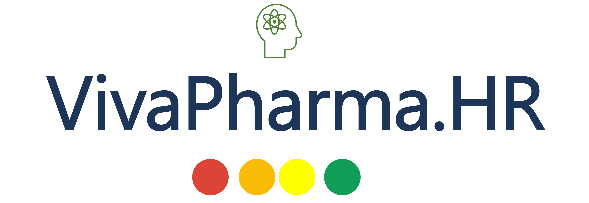
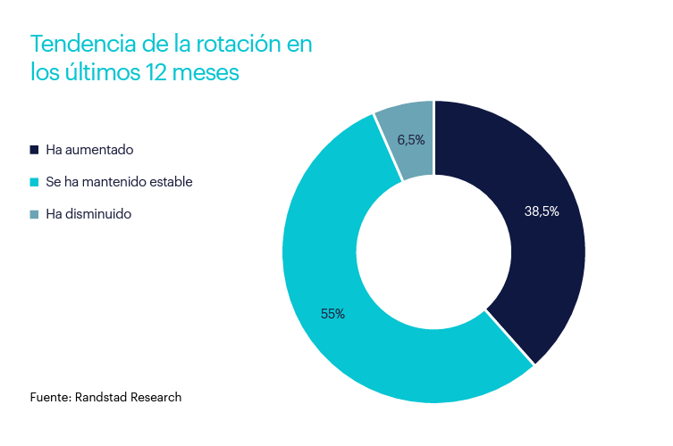
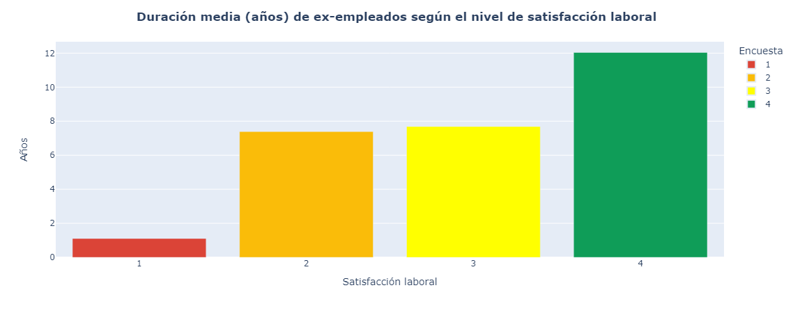
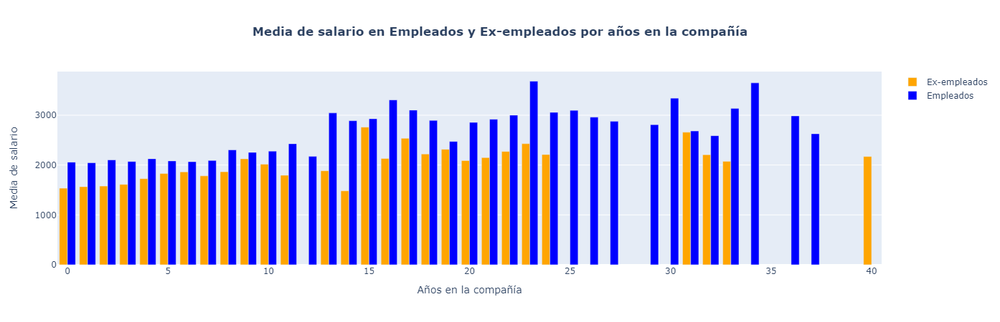
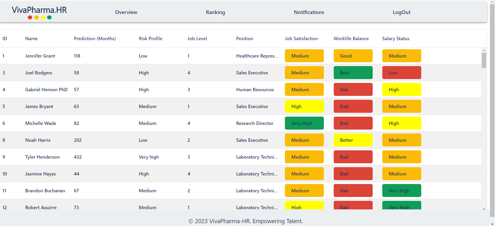
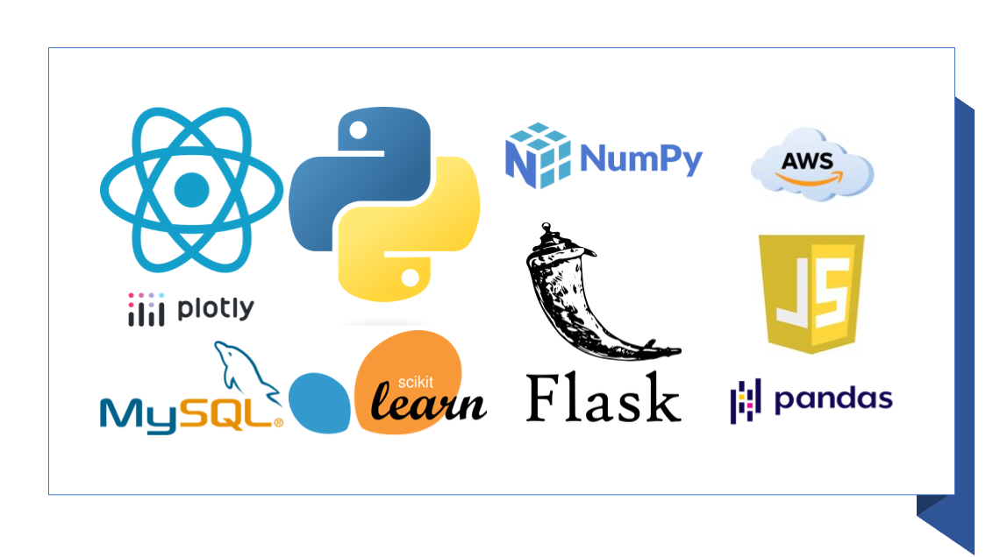
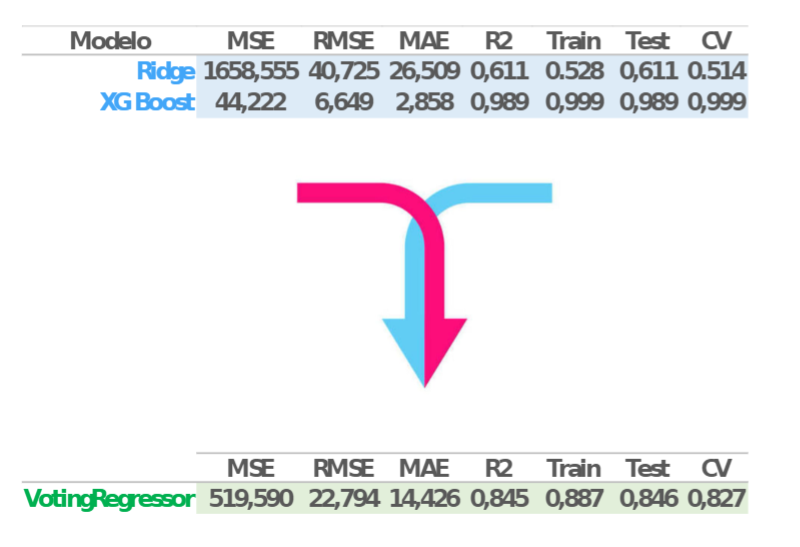

# 
# :altavoz_sonando: VivaPharma Retention Predictor
## **Impulsando la retención de talento :científica::tono-de-piel-3::oficinista_mujer::tono-de-piel-4::tecnólogo::tono-de-piel-2:**
:hola: ¡Hola! Somos Vivapharma :tubo_de_ensayo:, la empresa líder en la industria farmacéutica.
En nuestro departamento de Desarrollo y Tecnología, hemos recibido una solicitud muy importante del departamento de Recursos Humanos. Nos han comunicado la problemática existente en nuestra industria con respecto a la retención de talento y nos han encomendado encontrar una solución..
### **¡Comencemos!:cohete:**
## **:espadas_cruzadas::silueta_de_cabeza_parlante::cronómetro:PROBLEMÁTICA**
Nuestro principal problema es la pérdida de personal y el alto coste que esto representa para la empresa.
Entre los principales costes se encuentran:
- ``Costes de reclutamiento y contratación``: Honorarios de agencias de contratación y tiempo invertido en el proceso de reclutamiento.
- ``Costes de capacitación``: Formación de nuevos empleados para ocupar puestos vacantes y tiempo de adaptación.
- ``Costes de productividad``: Disminución de la productividad durante la transición entre empleados.
- ``Costes de salida``: Pago de indemnizaciones y liquidación de salarios.
- ``Reputación externa``: Pérdida de reputación como empleador y dificultad para atraer nuevos talentos.
## **:gráfico_de_barras::gráfico_con_tendencia_ascendente::gráfico_con_tendencia_descendente:DATOS**
Analizando la rotación laboral en España en los últimos 12 meses:

**Conclusiones:**
*  Casi 4 de cada 10 empresas (un 38,5%) han experimentado incrementos en sus niveles de rotación.
*  Solo un 6,5% declaran haber observado disminuciones en dicha variable.
### **:libros::gráfico_de_barras::gráfico_con_tendencia_ascendente::gráfico_con_tendencia_descendente:DATOS DE VIVAPHARMA**
**A continuación analizaremos dos de las variables que más influyen en la permanencia en VivaPharma:**
- Según la encuestra trimestral realizada por el departamento de Recursos Humanos:

**Conclusión:**
Los ex-empleados de VivaPharma que mayor satisfacción han mostrado con su trabajo son los que han permanecido en la empresa durante más tiempo.
- Otra variable clave en la retención de talento es el salario:

**Conclusión:**
En esta gráfica observamos que los empleados que permanecen en la empresa son los que mayor salario medio perciben con respecto a los que se han marchado.
## **SOLUCIÓN:bombilla:**
En respuesta a la pérdida de personal altamente capacitado y los costos asociados, hemos creado una aplicación web impulsada por inteligencia artificial. Esta herramienta predice la duración promedio de los empleados en la empresa y nos ayuda a identificar áreas de mejora para cambiar esta tendencia.
### **VivaPharma HR :globo_terráqueo_con_meridianos:**
Link a la web: [VivaPharma HR](https://vivapharma-hr.onrender.com/)

En la web aparecen las métricas más importantes a valorar por cada departamento de la empresa acerca de la situación de sus trabajadores; desde estatus salarial hasta satisfacción de los empleados.
### **¿Qué tecnologías hemos usado? :cara_pensativa::ordenador:**

### **:cara_de_robot: Modelo de Machine Learning**
Para abordar nuestra problemática de regresión lineal, hemos realizado pruebas con varios modelos y hemos seleccionado el modelo Ridge y XGBoost como los más efectivos. Con el objetivo de obtener los mejores resultados posibles, hemos creado un ensemble combinando ambos modelos.
Este enfoque de ensemble nos permite aprovechar las fortalezas individuales de cada modelo y combinar sus predicciones para lograr una mayor precisión en nuestras predicciones. Al combinar la regularización de Ridge con la capacidad de XGBoost para manejar relaciones no lineales, hemos obtenido un modelo más robusto y capaz de capturar las complejidades de nuestro conjunto de datos.

## **Próximos pasos :llave_de_tuerca::pronto:**
* :advertencia: Establecer sistemas de alerta vía email para avisar al departamento de RRHH cuando un empleado esté en riesgo inminente de abandonar la empresa.
* :candado: Incorporar permisos de accesos para jefes de departamento y directivos.
* :hombre_levantando_pesas: Incluir la opción de reentrenar el modelo con nuevos datos.
* :construcción: Incluir tablas, a partir de los datos preexistentes, de personal crítico para la empresa con el objetivo de anticiparse a posibles bajas.
* :bolsa_de_dinero: Contabilización de costes.
* :carpeta_abierta: Opción de exportar ficheros a cualquer formato.